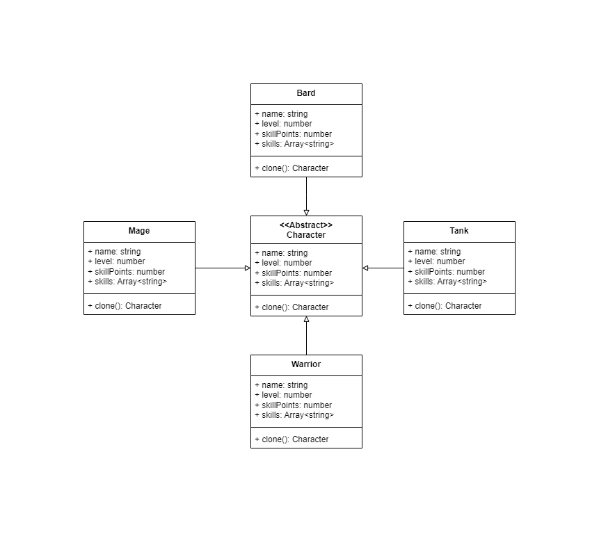

# Character Cloning

# Pattern Type: 

Creational: The problem is how to create new Characters from existing ones

# Design Pattern

Protype: a creational design pattern that lets you copy existing objects without being dependant on their classes.

# Class Diagram

